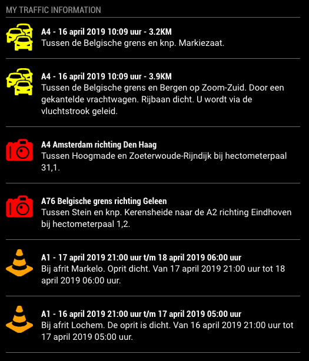

# MMM-MyTraffic
MMM-Mytraffic is a MagicMirror module for dutch traffic information, using real-time information from the ANWB.



## Installation
Clone this repository in your modules folder, and install dependencies:

```
cd ~/MagicMirror/modules 
git clone https://github.com/htilburgs/MMM-MyTraffic
cd MMM-MyTravvic
npm install 
```

## Configuration
Go to the MagicMirror/config directory and edit the config.js file.
Add the module to your modules array in your config.js.

```
{
  module: 'MMM-MyTraffic',
  position: 'top_left',
  header: 'My Traffic Information',
  config: {
  	   showJams: true,		// Show Traffic jams
	   showConstructions: true,	// Show Constructions
	   showRadars: true,		// Show Speed Traps (Radar Controls)
	   preferredRoads: ['ALL']	// Show All roads or show you're selection -> ['A1','A50','A67']
	  }
},
```

## Module configuration
Here is the documentation of options for the modules configuration:

<table>
  <thead>
    <tr>
      <th>Option</th>
      <th>Description</th>
    </tr>
  </thead>
  <tbody>
    <tr>
      <td><code>showJams</code></td>
      <td>Show Traffic Jams on the Dutch highways<br /><br /><strong>True/False</strong><br />Default: <code>True</code></td>
    </tr>
    <tr>
      <td><code>showConstructions</code></td>
      <td>Show Construcion works for the Dutch highways<br /><br /><strong>True/False</strong><br />Default: <code>True</code></td>
    </tr>
    <tr>
      <td><code>showRadars</code></td>
      <td>Show Speed traps (Radar Controls) on the Dutch highways<br /><br /><strong>True/False</strong><br />Default: <code>True</code></td>
    </tr>    
    <tr>
      <td><code>preferredRoads</code></td>
      <td>Show ALL roads or show you're own selection<br /><br /><strong>Array</strong><br />Default: <code>['ALL']</code><br /><br /><strong>Example selection:</strong> preferredRoads: ['A1' , 'A2' , 'A50' , 'A67']</td>
    </tr>    
</tbody>
</table>

### Special thanks
A special thanks to Sam Detweil for helping me out with some issues!

## License
### The MIT License (MIT)

Copyright © 2019 Harm Tilburgs

Permission is hereby granted, free of charge, to any person obtaining a copy of this software and associated documentation files (the “Software”), to deal in the Software without restriction, including without limitation the rights to use, copy, modify, merge, publish, distribute, sublicense, and/or sell copies of the Software, and to permit persons to whom the Software is furnished to do so, subject to the following conditions:

The above copyright notice and this permission notice shall be included in all copies or substantial portions of the Software.

The software is provided “as is”, without warranty of any kind, express or implied, including but not limited to the warranties of merchantability, fitness for a particular purpose and noninfringement. In no event shall the authors or copyright holders be liable for any claim, damages or other liability, whether in an action of contract, tort or otherwise, arising from, out of or in connection with the software or the use or other dealings in the software.
